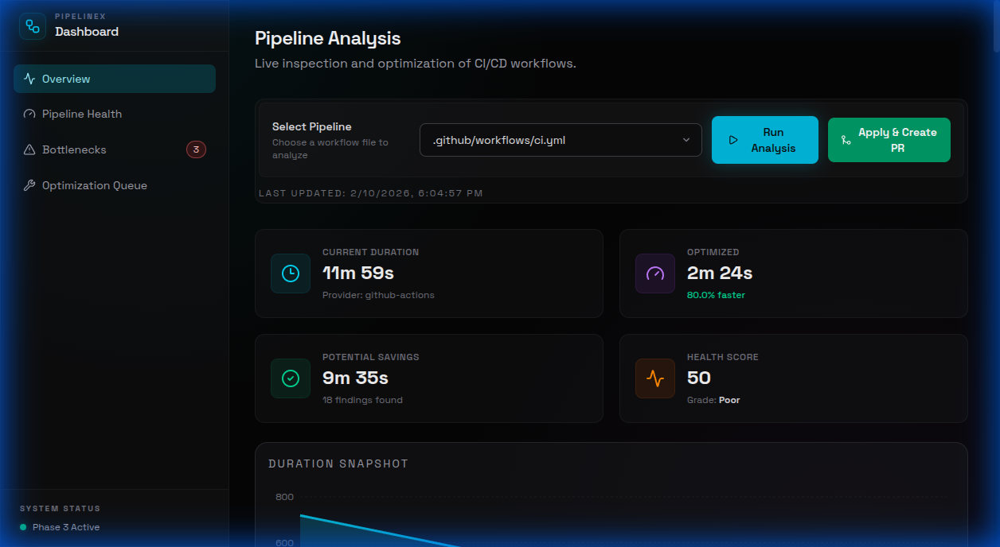
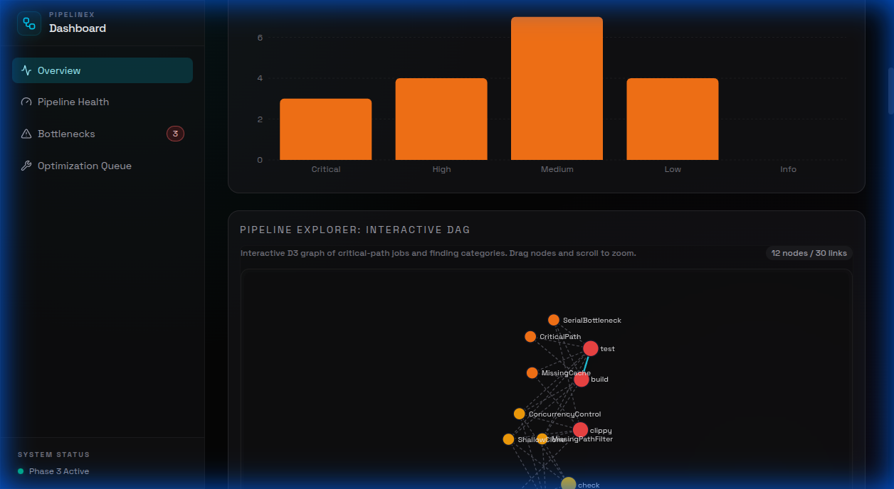
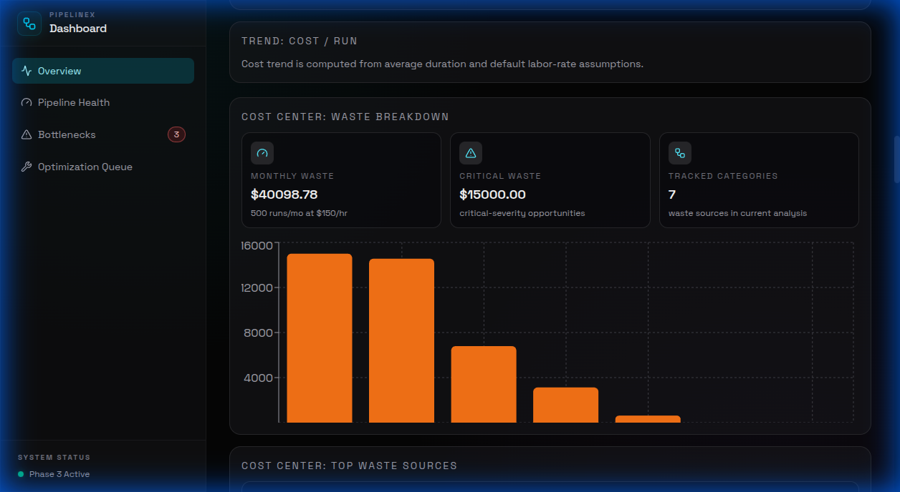

# PipelineX

<div align="center">

**Your pipelines are slow. PipelineX knows why — and fixes them automatically.**

[](https://github.com/mackeh/PipelineX/actions/workflows/ci.yml)
[](LICENSE)
[](#supported-ci-platforms)

[Features](#-features) •
[Quick Start](#-quick-start) •
[Demo](#-demo) •
[Platforms](#-supported-ci-platforms) •
[Commands](#-commands) •
[Contributing](CONTRIBUTING.md)

</div>

---

## 🎯 The Problem

**Developers lose 45-90 minutes daily waiting for CI/CD pipelines.**

Most of that time is wasted on:

- ❌ Missing caches → **2-8 min/run** reinstalling dependencies
- ❌ Serial jobs that could parallelize → **5-20 min/run**
- ❌ Running all tests on single-file changes → **3-30 min/run**
- ❌ Docker builds without layer caching → **3-12 min/run**
- ❌ Flaky tests causing retries → **5-15 min/run**

**PipelineX detects ALL of this and generates the fix.**

---

## ✨ Features

<table>
<tr>
<td width="33%" valign="top">

### 🔍 **Multi-Platform Analysis**

Supports 11 major CI systems:

- GitHub Actions
- GitLab CI
- Jenkins
- CircleCI
- Bitbucket Pipelines
- Azure Pipelines
- AWS CodePipeline
- Buildkite
- Drone CI / Woodpecker CI
- Tekton Pipelines
- Argo Workflows

Analyzes YAML/Groovy configs offline — no account or API needed.

</td>
<td width="33%" valign="top">

### 🚀 **Smart Optimization**

**12 antipattern detectors:**

- Missing caches
- Serial bottlenecks
- False dependencies
- Flaky tests
- Path filtering
- Matrix bloat
- Docker inefficiencies
- ...and more

**50-85% time savings** typical

</td>
<td width="33%" valign="top">

### 🎨 **Rich Output**

Multiple formats:

- **Text** (colored terminal)
- **JSON** (structured data)
- **SARIF** (GitHub Code Scanning)
- **HTML** (interactive reports)

Auto-generates optimized configs

</td>
</tr>
</table>

---

## 🚀 Quick Start

### Installation

```bash
# From source
cargo install --git https://github.com/mackeh/PipelineX pipelinex-cli

# Build locally
git clone https://github.com/mackeh/PipelineX.git
cd PipelineX
cargo build --release
```

An intelligent CI/CD analysis platform that watches your pipelines, identifies exactly where time and money are wasted, and generates optimized configurations that make builds 2–10x faster. Works across GitHub Actions, GitLab CI, Jenkins, Bitbucket Pipelines, CircleCI, Azure Pipelines, AWS CodePipeline, and more — with zero changes to your existing setup.



### Interactive Visualization



### Deep Cost Analysis



---

### Basic Usage

```bash
# Analyze your pipeline
pipelinex analyze .github/workflows/ci.yml

# Generate optimized config
pipelinex optimize .github/workflows/ci.yml -o ci-optimized.yml

# See what changes
pipelinex diff .github/workflows/ci.yml

# Estimate savings
pipelinex cost .github/workflows/ --runs-per-month 500

# Visualize the DAG
pipelinex graph .github/workflows/ci.yml

# Detect flaky tests
pipelinex flaky test-results/

# Smart test selection (run only affected tests)
pipelinex select-tests HEAD~1 HEAD

# Analyze historical run data from GitHub
pipelinex history --repo owner/repo --workflow ci.yml --runs 100
```

---

## 🔗 Quick Integration

**One-line install:**

```bash
curl -fsSL https://raw.githubusercontent.com/mackeh/PipelineX/main/install.sh | bash
```

**Docker:**

```bash
docker run --rm -v $(pwd):/workspace:ro mackeh/pipelinex analyze /workspace/.github/workflows/ci.yml
```

**GitHub Actions (SARIF Upload):**

```yaml
- uses: actions/checkout@v4
- run: cargo install --git https://github.com/mackeh/PipelineX pipelinex-cli
- run: pipelinex analyze .github/workflows/ci.yml --format sarif > results.sarif
- uses: github/codeql-action/upload-sarif@v3
  with:
    sarif_file: results.sarif
```

**VS Code / Makefile / Pre-commit:**
Pre-configured tasks and hooks included — just run `make help` or see [QUICKSTART.md](docs/QUICKSTART.md)

📚 **[Full Integration Guide](docs/INTEGRATIONS.md)** | **[Quick Start Guide](docs/QUICKSTART.md)** | **[Examples](examples/integrations/)**
📦 **Self-hosted:** [docs/SELF_HOSTING.md](docs/SELF_HOSTING.md)
🔌 **REST API:** [docs/REST_API.md](docs/REST_API.md)
🧩 **VS Code Extension:** [docs/VS_CODE_EXTENSION.md](docs/VS_CODE_EXTENSION.md)

---

## 🎬 Demo

### **Real-World Example: Full-Stack CI Pipeline**

**Before PipelineX:** 31 minutes, serial execution, no caching

```yaml
# .github/workflows/ci.yml (unoptimized)
jobs:
  setup:
    runs-on: ubuntu-latest
    steps:
      - uses: actions/checkout@v4
      - run: npm ci # ← No cache! Reinstalls every run

  lint:
    needs: setup # ← False dependency
    runs-on: ubuntu-latest
    steps:
      - uses: actions/checkout@v4
      - run: npm ci # ← Reinstalls again!
      - run: npm run lint

  test:
    needs: lint # ← Another false dependency
    runs-on: ubuntu-latest
    steps:
      - uses: actions/checkout@v4
      - run: npm ci # ← Third reinstall!
      - run: npm test # ← Runs ALL tests on doc changes
```

**Running PipelineX:**

```bash
$ pipelinex analyze .github/workflows/ci.yml
```

<details>
<summary><b>📊 Click to see analysis output</b></summary>

```
 PipelineX v2.1.1 — Analyzing ci.yml

 Pipeline Structure
 |- 6 jobs, 23 steps
 |- Max parallelism: 2
 |- Critical path: setup -> lint -> test -> build -> deploy (31:00)
 |- Provider: github-actions

 ============================================================

  CRITICAL  No dependency caching for npm/yarn/pnpm
   | Job 'setup' runs 'npm ci' without caching node_modules.
   | Estimated savings: 2:30/run
   | Confidence: 95% | Auto-fixable
   | Fix: Add actions/cache for node_modules

  HIGH  'test' depends on 'lint' unnecessarily
   | These jobs share no artifacts — safe to parallelize
   | Estimated savings: 4:27/run
   | Confidence: 80% | Auto-fixable

  HIGH  'lint' depends on 'setup' unnecessarily
   | These jobs share no artifacts — safe to parallelize
   | Estimated savings: 3:30/run

  MEDIUM  No path-based filtering on triggers
   | Full pipeline runs on docs-only changes.
   | Estimated savings: 100% on non-code changes
   | Fix: Add paths-ignore filter

  MEDIUM  3 jobs independently install dependencies
   | Jobs [setup, lint, test] each run 'npm ci' separately
   | Estimated savings: 5:00/run
   | Fix: Cache or use artifacts

 ============================================================

 Summary
 |- Current est. pipeline time:    31:00
 |- Optimized projection:          6:12
 |- Potential time savings:        80.0%
 |- Findings: 3 critical, 2 high, 3 medium

 Run pipelinex optimize to generate optimized config
```

</details>

**After Optimization:**

```bash
$ pipelinex optimize .github/workflows/ci.yml -o ci-optimized.yml
```

<details>
<summary><b>✅ Click to see optimized config</b></summary>

```yaml
# .github/workflows/ci-optimized.yml
on:
  push:
    paths-ignore: # ← Skip pipeline on doc changes
      - "**.md"
      - "docs/**"

jobs:
  setup:
    runs-on: ubuntu-latest
    steps:
      - uses: actions/checkout@v4
      - uses: actions/setup-node@v4
        with:
          cache: "npm" # ← Built-in caching!
      - run: npm ci
      - uses: actions/cache/save@v4 # ← Save for other jobs
        with:
          path: node_modules
          key: deps-${{ hashFiles('package-lock.json') }}

  lint:
    needs: setup
    runs-on: ubuntu-latest
    steps:
      - uses: actions/checkout@v4
      - uses: actions/cache/restore@v4 # ← Restore cached deps
        with:
          path: node_modules
          key: deps-${{ hashFiles('package-lock.json') }}
      - run: npm run lint

  test:
    needs: setup # ← Runs parallel with lint now!
    runs-on: ubuntu-latest
    strategy:
      matrix:
        shard: [1, 2, 3] # ← Sharded tests (3x faster)
    steps:
      - uses: actions/checkout@v4
      - uses: actions/cache/restore@v4
        with:
          path: node_modules
          key: deps-${{ hashFiles('package-lock.json') }}
      - run: npm test -- --shard=${{ matrix.shard }}/3

  build:
    needs: [lint, test]
    # ... rest of pipeline
```

</details>

**Results:**

| Metric           | Before   | After   | Improvement           |
| ---------------- | -------- | ------- | --------------------- |
| **Time**         | 31:00    | 6:12    | **80% faster** ⚡     |
| **Parallelism**  | 1-2 jobs | 4+ jobs | **2x more efficient** |
| **Cache hits**   | 0%       | 90%+    | **5 min saved/run**   |
| **Monthly cost** | $240/mo  | $48/mo  | **$192 saved** 💰     |

---

### **Demo 2: Cost Analysis**

```bash
$ pipelinex cost .github/workflows/ --runs-per-month 500 --team-size 10
```

<details>
<summary><b>💰 Click to see cost breakdown</b></summary>

```
 PipelineX v2.1.1 — Cost Estimation

 Pipeline: ci.yml
 |- Runs per month: 500
 |- Team size: 10 developers

 Current Costs
 |- Compute: $156/month (ubuntu-latest)
 |- Developer time: 258 hours/month waiting
 |- Developer cost: $38,700/month (@ $150/hr)
 |- Total monthly waste: $38,856

 Optimized Costs
 |- Compute: $31/month (80% reduction)
 |- Developer time: 52 hours/month
 |- Developer cost: $7,800/month
 |- Total optimized: $7,831

 💰 Monthly Savings: $31,025
 📈 Annual Savings: $372,300
 ⚡ Time back to devs: 206 hours/month

 Recommendation: Implement optimizations immediately
 ROI: Break-even in < 1 day
```

</details>

---

### **Demo 3: Smart Test Selection**

Only run tests affected by your changes:

```bash
$ pipelinex select-tests HEAD~1 HEAD
```

<details>
<summary><b>🎯 Click to see test selection output</b></summary>

```
 PipelineX v2.1.1 — Smart Test Selection

 Changed Files
 |- src/auth/login.rs
 |- src/auth/session.rs
 |- tests/integration/api_test.rs

 Selected Tests
 |- tests/auth/login_test.rs          (source changed)
 |- tests/auth/session_test.rs        (source changed)
 |- tests/integration/api_test.rs     (test file changed)
 |- integration                        (always-run pattern)
 |- e2e                                (always-run pattern)

 Selection Summary
 |- Running ~15% of tests based on changes
 |- Est. time savings: 85%
 |- From: 28 minutes → To: 4 minutes

 Reasoning
 |- Direct: tests/integration/api_test.rs (test file changed)
 |- Affected: tests/auth/login_test.rs (source file src/auth/login.rs changed)
 |- Affected: tests/auth/session_test.rs (source file src/auth/session.rs changed)
 |- Always-run: integration
 |- Always-run: e2e

 💡 Tip: Use pipelinex select-tests --format json for CI integration
```

</details>

---

### **Demo 4: Flaky Test Detection**

Identify unreliable tests from JUnit XML:

```bash
$ pipelinex flaky test-results/
```

<details>
<summary><b>🔬 Click to see flaky test report</b></summary>

```
 PipelineX v2.1.1 — Flaky Test Detector

 Detection Summary
 |- Total tests analyzed: 247
 |- Flaky tests found: 3
 |- Flakiness ratio: 1.2%
 |- Confidence: High

 ============================================================

 FLAKY Flakiness: 78%
   | UserServiceTests::test_concurrent_user_creation
   | Category: Unstable (alternating pass/fail)
   | Runs: 15 | Passed: 8 | Failed: 7 | Failure rate: 46.7%
   | Recent failures:
   |   - Expected user count 5 but got 4 (race condition)
   |   - Timeout waiting for database transaction

 FLAKY Flakiness: 52%
   | PaymentTests::test_external_api_call
   | Category: Environment-Sensitive (network, timeouts)
   | Runs: 12 | Passed: 9 | Failed: 3 | Failure rate: 25.0%
   | Recent failures:
   |   - Connection timeout after 5000ms
   |   - DNS lookup failed

 FLAKY Flakiness: 34%
   | CacheTests::test_cache_invalidation
   | Category: Timing-Dependent (race conditions)
   | Runs: 10 | Passed: 8 | Failed: 2 | Failure rate: 20.0%

 ============================================================

 Recommendations
 |- Quarantine flaky tests to prevent blocking CI
 |- Investigate timing-dependent tests for race conditions
 |- Add retries for environment-sensitive tests
 |- Track flakiness over time to identify trends

 💡 Next: pipelinex flaky --format json > flaky-tests.json
```

</details>

---

### **Demo 5: Interactive HTML Reports**

Generate beautiful, self-contained reports:

```bash
$ pipelinex analyze .github/workflows/ci.yml --format html > report.html
$ open report.html
```

**Features:**

- 🎨 Dark mode toggle
- 📊 Interactive DAG visualization
- 🔍 Collapsible finding details
- 📈 Stats cards with severity badges
- 💾 Self-contained (works offline)

---

### **Demo 6: Pipeline Simulation**

Monte Carlo simulation with timing variance:

```bash
$ pipelinex simulate .github/workflows/ci.yml --runs 1000
```

For large simulations, PipelineX shows progress in text mode (TTY) and you can tune output size:

```bash
# Show only top 8 jobs in the text table
$ pipelinex simulate .github/workflows/ci.yml --runs 10000 --top-jobs 8

# Disable progress rendering (for CI logs)
$ pipelinex simulate .github/workflows/ci.yml --runs 10000 --no-progress

# Full machine-readable output
$ pipelinex simulate .github/workflows/ci.yml --runs 10000 --format json
```

<details>
<summary><b>📊 Click to see simulation results</b></summary>

```
 PipelineX Simulation — CI Pipeline (1000 runs)

 Duration Distribution
   Min:     24:19
   p50:     30:53  (median)
   p90:     34:14  (90th percentile)
   p99:     37:00  (99th percentile)
   Max:     37:52
   Mean:    31:00 (std dev: 2:32)

 Timing Histogram
    24:00 -  26:30 ████ 8
    26:30 -  29:00 ████████████ 24
    29:00 -  31:30 ████████████████████████████ 58
    31:30 -  34:00 ██████████████████████ 42
    34:00 -  36:30 ████████ 16
    36:30 -  39:00 ██ 4

 Job Analysis
   Job                      Mean      p50      p90  Crit.Path%
   setup                    3:25     3:26     4:05      100%
   lint                     4:27     4:26     5:18      100%
   test                     8:22     8:25     9:55      100%
   build                   12:33    12:30    15:09       99%
   e2e                      7:53     7:52     9:18        1%
   deploy                   2:12     2:12     2:37      100%

 Critical Path Insights
 |- Most variable: build (±20% timing variance)
 |- Consistent: deploy (±3% variance)
 |- 90% of runs complete under: 34:14
```

</details>

---

## 🏗️ Supported CI Platforms

| Platform                  | Status             | Features                                                   |
| ------------------------- | ------------------ | ---------------------------------------------------------- |
| **GitHub Actions**        | ✅ Fully Supported | Workflows, jobs, matrices, caches, artifacts, path filters |
| **GitLab CI**             | ✅ Fully Supported | Stages, needs, parallel, rules, hidden jobs, DAG           |
| **Jenkins**               | ✅ Fully Supported | Declarative pipelines, stages, parallel, agents            |
| **CircleCI**              | ✅ Fully Supported | Workflows, jobs, executors, orbs, caches                   |
| **Bitbucket Pipelines**   | ✅ Fully Supported | Pipelines, parallel, deployments, services                 |
| **Azure Pipelines**       | ✅ Fully Supported | Stages, jobs, dependencies, templates                      |
| **AWS CodePipeline**      | ✅ Fully Supported | Stages, actions, runOrder, artifacts                       |
| **Buildkite**             | ✅ Fully Supported | Steps, depends_on, wait/block barriers, plugins, artifacts |
| **Drone CI / Woodpecker** | ✅ Fully Supported | Multi-doc pipelines, depends_on DAG parsing, triggers      |
| **Tekton Pipelines**      | ✅ Fully Supported | Pipeline/Task/PipelineRun CRDs, runAfter/finally support   |
| **Argo Workflows**        | ✅ Fully Supported | DAG/steps templates, dependencies, when conditions         |
| Travis CI                 | 🔜 Planned         | Stages, jobs, matrix                                       |

**Want your CI platform supported?** [Open an issue](https://github.com/mackeh/PipelineX/issues/new?template=ci_platform_request.md)!

---

## 📋 Commands

| Command        | Description                                | Example                                                                       |
| -------------- | ------------------------------------------ | ----------------------------------------------------------------------------- |
| `analyze`      | Analyze pipelines for bottlenecks          | `pipelinex analyze .github/workflows/ci.yml`                                  |
| `optimize`     | Generate optimized config                  | `pipelinex optimize ci.yml -o ci-opt.yml`                                     |
| `diff`         | Show changes between current and optimized | `pipelinex diff ci.yml`                                                       |
| `apply`        | Apply optimization & create PR (one-click) | `pipelinex apply .github/workflows/ci.yml --repo owner/repo`                  |
| `cost`         | Estimate CI/CD costs and savings           | `pipelinex cost .github/workflows/ --team-size 10`                            |
| `graph`        | Visualize pipeline DAG                     | `pipelinex graph ci.yml --format mermaid`                                     |
| `simulate`     | Monte Carlo simulation                     | `pipelinex simulate ci.yml --runs 1000 --top-jobs 12`                         |
| `explain`      | Generate actionable finding explanations   | `pipelinex explain ci.yml --runs-per-month 800`                               |
| `what-if`      | Model DAG changes before editing config    | `pipelinex what-if ci.yml --modify "add-cache build 120"`                     |
| `lint`         | Lint CI configs for schema/deprecations    | `pipelinex lint .github/workflows/ --format json`                             |
| `compare`      | Compare two pipeline configs               | `pipelinex compare ci-old.yml ci-new.yml`                                     |
| `docker`       | Analyze Dockerfiles                        | `pipelinex docker Dockerfile --optimize`                                      |
| `select-tests` | Smart test selection                       | `pipelinex select-tests HEAD~1 HEAD`                                          |
| `flaky`        | Detect flaky tests                         | `pipelinex flaky test-results/*.xml`                                          |
| `history`      | Analyze workflow run history               | `pipelinex history --repo org/repo --workflow ci.yml --runs 100`              |
| `migrate`      | Migrate CI provider config                 | `pipelinex migrate .github/workflows/ci.yml --to gitlab-ci -o .gitlab-ci.yml` |
| `multi-repo`   | Analyze cross-repo orchestration patterns  | `pipelinex multi-repo /path/to/repos --format json`                           |
| `right-size`   | Recommend right-sized CI runners           | `pipelinex right-size .github/workflows/ --format json`                       |
| `plugins`      | Plugin scaffold/list                       | `pipelinex plugins scaffold .pipelinex/plugins.json`                          |

### Output Formats

- `--format text` - Colored terminal output (default)
- `--format json` - Structured JSON for automation
- `--format sarif` - SARIF 2.1.0 for GitHub Code Scanning
- `--format html` - Interactive HTML report
- `--format yaml` - YAML output (select-tests)

---

## 🎯 Use Cases

### **For Developers**

- ⚡ Reduce wait time from 30+ min to < 10 min
- 🎯 Run only relevant tests (85% time saved)
- 🔧 Understand what slows down CI
- 🚀 Ship features faster

### **For DevOps Teams**

- 📊 Cost optimization ($10k-$100k+ annual savings)
- 🔍 Pipeline health monitoring
- 📈 Track improvements over time
- 🛠️ Auto-generate optimized configs

### **For Platform Engineers**

- 🔄 Migrate between CI platforms
- 📐 Standardize pipeline patterns
- 📚 Enforce best practices
- 🎓 Educate teams on CI/CD

### **For CTOs**

- 💰 Quantify CI waste
- 📊 ROI reporting
- ⏱️ Developer productivity gains
- 🎯 Data-driven decisions

---

## 🏆 What Makes PipelineX Different

|                          | PipelineX       | BuildPulse     | Datadog CI   | Trunk Analytics |
| ------------------------ | --------------- | -------------- | ------------ | --------------- |
| **Multi-platform**       | ✅ 11 CI systems | ❌ GitHub only | ✅           | ❌ GitHub only  |
| **Offline CLI**          | ✅              | ❌ SaaS only   | ❌ SaaS only | ❌ SaaS only    |
| **Auto-generates fixes** | ✅              | ❌             | ❌           | ❌              |
| **Smart test selection** | ✅              | ❌             | ❌           | ❌              |
| **Flaky test detection** | ✅              | ✅             | ✅           | ✅              |
| **Docker optimization**  | ✅              | ❌             | ❌           | ❌              |
| **Cost estimation**      | ✅              | ❌             | Partial      | ❌              |
| **Pipeline simulation**  | ✅              | ❌             | ❌           | ❌              |
| **Free & open source**   | ✅ MIT          | ❌ Paid        | ❌ Paid      | Limited free    |

---

## 🔗 Integrations

**GitHub Actions:** [See templates](.github/workflow-templates/)

```yaml
- name: Analyze Pipeline
  run: pipelinex analyze .github/workflows/ci.yml --format sarif > results.sarif
- uses: github/codeql-action/upload-sarif@v3
  with:
    sarif_file: results.sarif
```

**GitLab CI:**

```yaml
pipelinex:
  script:
    - pipelinex analyze .gitlab-ci.yml --format json > gl-code-quality-report.json
  artifacts:
    reports:
      codequality: gl-code-quality-report.json
```

**VS Code:**

```json
{
  "tasks": [
    {
      "label": "PipelineX: Analyze",
      "type": "shell",
      "command": "pipelinex analyze .github/workflows/ci.yml"
    }
  ]
}
```

For inline optimization hints in workflow files, use the local extension in `vscode-extension/`:

```bash
cd vscode-extension
npm install
npm run build
```

**Pre-commit Hook:**

```bash
#!/bin/bash
pipelinex analyze .github/workflows/ci.yml --format json | \
  jq -e '.findings | map(select(.severity == "Critical")) | length == 0'
```

📚 **Full integration guide:** [docs/INTEGRATIONS.md](docs/INTEGRATIONS.md)

---

## 🧪 Testing

```bash
# Run all tests
cargo test

# Run with output
cargo test -- --nocapture

# Test specific feature
cargo test test_analyze_github

# Integration tests only
cargo test --test integration_tests
```

**Test Coverage:**

- ✅ 67 tests (41 unit + 26 integration)
- ✅ 32 fixtures across all platforms
- ✅ Real-world pipeline samples

---

## 🏗️ Architecture

```
┌─────────────────┐
│  Pipeline YAML  │
└────────┬────────┘
         │
         v
┌─────────────────┐      ┌──────────────────┐
│  Parser Layer   │ ───> │  Pipeline DAG    │
│ (11 platforms)  │      │  (petgraph)      │
└─────────────────┘      └────────┬─────────┘
                                  │
                                  v
         ┌────────────────────────┴───────────────────────┐
         │                                                │
         v                                                v
┌─────────────────┐                            ┌─────────────────┐
│  Analyzers (12) │                            │   Optimizers    │
│  - Cache        │                            │  - Config Gen   │
│  - Parallel     │                            │  - Shard        │
│  - Critical Path│                            │  - Docker       │
│  - Waste        │                            └─────────────────┘
└────────┬────────┘
         │
         v
┌─────────────────┐      ┌──────────────────┐
│  Report Engine  │ ───> │  Output Formats  │
│  - Findings     │      │  Text/JSON/SARIF │
│  - Metrics      │      │  HTML/YAML       │
└─────────────────┘      └──────────────────┘
```

**Key Components:**

- **Universal Parser:** Normalizes 11 CI formats into a unified DAG
- **Analyzer Suite:** 12 detectors for bottlenecks and antipatterns
- **Optimizer Engine:** Generates production-ready configs
- **Output Adapters:** Multiple formats for different workflows

---

## 🤝 Contributing

We welcome contributions! See [CONTRIBUTING.md](CONTRIBUTING.md) for:

- 🛠️ Adding new CI platform parsers (with templates)
- 🔍 Creating new analyzers
- ⚙️ Building optimizers
- 📚 Improving docs
- 🐛 Reporting bugs

**Quick start for contributors:**

1. Fork the repo
2. Create a feature branch
3. Follow the templates in CONTRIBUTING.md
4. Add tests
5. Open a PR

---

## 📚 Documentation

- [CONTRIBUTING.md](CONTRIBUTING.md) - Contributor guide with templates
- [docs/INTEGRATIONS.md](docs/INTEGRATIONS.md) - Integration patterns
- [docs/REST_API.md](docs/REST_API.md) - Public REST API for custom integrations
- [docs/SELF_HOSTING.md](docs/SELF_HOSTING.md) - Docker Compose and Helm deployment
- [docs/VS_CODE_EXTENSION.md](docs/VS_CODE_EXTENSION.md) - Inline workflow hints in VS Code
- [docs/MIGRATION_ASSISTANT.md](docs/MIGRATION_ASSISTANT.md) - GitHub Actions to GitLab CI migration assistant
- [docs/MULTI_REPO_ANALYSIS.md](docs/MULTI_REPO_ANALYSIS.md) - Cross-repo orchestration and monorepo risk analysis
- [docs/RUNNER_SIZING.md](docs/RUNNER_SIZING.md) - Resource-profiled runner right-sizing recommendations
- [docs/EXPLAIN_WHATIF.md](docs/EXPLAIN_WHATIF.md) - Finding explanations and what-if scenario simulation
- [docs/ALERTS.md](docs/ALERTS.md) - Threshold-based alert rules for duration, failure rate, and cost
- [docs/GITHUB_APP_PR_ANALYSIS.md](docs/GITHUB_APP_PR_ANALYSIS.md) - GitHub App PR webhook analysis and automated PR comments
- [docs/PLUGINS.md](docs/PLUGINS.md) - External plugin manifest and protocol
- [.github/workflow-templates/](.github/workflow-templates/) - GitHub Actions templates
- [tests/fixtures/](tests/fixtures/) - Example pipelines

---

## 📊 Project Status

- **Phase 1:** ✅ Core engine, GitHub Actions parser, CLI
- **Phase 2:** ✅ Multi-platform (11 CI systems), simulation, visualization
- **Phase 3:** ✅ **Complete!** Platform features (interactive DAG explorer, trend charts, flaky management UI, cost center dashboard, weekly digest API, GitHub App PR comments, webhook ingestion, threshold alerting, **one-click PR creation**, **team management & org-level views**)
- **Phase 4:** ✅ Complete (benchmarks, optimization impact tracking, migration assistant, runner right-sizing, multi-repo analysis, public/enterprise API hardening, self-hosted deploy, REST API, VS Code extension, plugin scaffold)

---

## 📄 License

MIT License - see [LICENSE](LICENSE) for details

---

## 🌟 Support

- ⭐ Star this repo if PipelineX helps you!
- 🐛 [Report bugs](https://github.com/mackeh/PipelineX/issues/new?template=bug_report.md)
- 💡 [Request features](https://github.com/mackeh/PipelineX/issues/new?template=feature_request.md)
- 💬 [Join discussions](https://github.com/mackeh/PipelineX/discussions)

<div align="center">

**Made with ❤️ by the open source community**

[⬆ Back to Top](#pipelinex)

</div>
